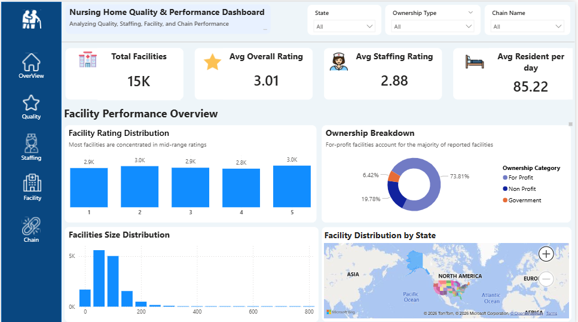
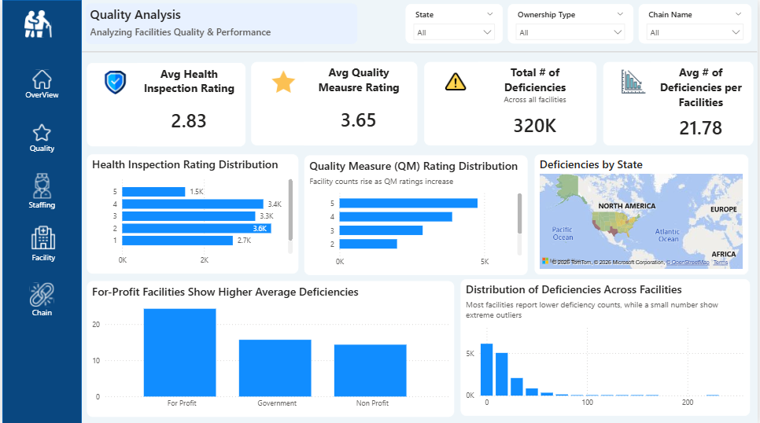

# 🏥 Nursing Home Quality & Performance Dashboard

**Nursing Home Quality &amp; Performance Dashboard — Excel Cleaning + Power BI Visualization (In Progress)**

This project analyzes **nursing home quality, staffing, ownership, and facility characteristics** using publicly available CMS datasets.
The goal is to build a **multi‑page Power BI dashboard** that provides clear insights into nursing home performance across the United States.

## 📌 Project Overview

This project follows a full analytics workflow:

1. **Excel** – Data cleaning, standardization, and quality checks  
2. **Power BI** – Data modeling and dashboard development  
3. **Dashboard Pages** (in progress):
    - ✔ **Overview Page** (Completed)
    - ⏳ Quality Page (In Progress)
    - ⏳ Staffing Page (In Progress)
    - ⏳ Facility Page (In Progress)
    - ⏳ Chain Ownership Page (In Progress)

## 📊 Completed: Overview Page

The Overview page provides insights into total facilities, average ratings, resident census, rating distribution, ownership breakdown, facility size distribution, and geographic distribution.

📸 Screenshot



### Quality Page
Provides insights into Quality Measure ratings, deficiency patterns, and facility performance.




## 🧹 Excel Data Cleaning

Cleaning steps performed:
- Removed duplicates
- Standardized column names
- Fixed inconsistent state codes
- Converted ratings to numeric
- Cleaned ownership categories
- Created cleaned_data.xlsx for Power BI import

## 📈 Power BI Development

- Built data model using cleaned Excel dataset
- Created DAX measures for ratings, counts, and averages
- Designed Overview page layout
- Added navigation sidebar for multi‑page experience
- Additional pages will be added as they are completed

## 🚧 Project Status: In Progress

This repository will be updated as each dashboard page is completed.

**Next steps:**
- Build Quality page (ratings, deficiencies, inspection trends)
- Build Staffing page (HPRD, RN hours, staffing ratings)
- Build Facility page (beds, occupancy, resident characteristics)
- Build Chain page (corporate ownership analysis)

## 🛠 Tools Used

**Excel** – Data cleaning & preparation  
**Power BI** – Dashboard design & modeling  
**GitHub** – Version control & portfolio hosting  

## 📁 Repository Structure

And include this:
```
nursing-home-quality-dashboard/
│
├── data/
│   ├── raw_cms_data.csv
│   └── cleaned_data.xlsx
│
├── excel-cleaning/
│   ├── cleaned_cms_data.xlsx
│   └── notes_on_data_quality.md
│
├── powerbi/
│   └── nursing_home_dashboard.pbix
│
├── images/
│   └── overview_page.png
│
└── README.md
```

## 📬Contact

If you’d like to discuss this project or my analytics work, feel free to reach out.
